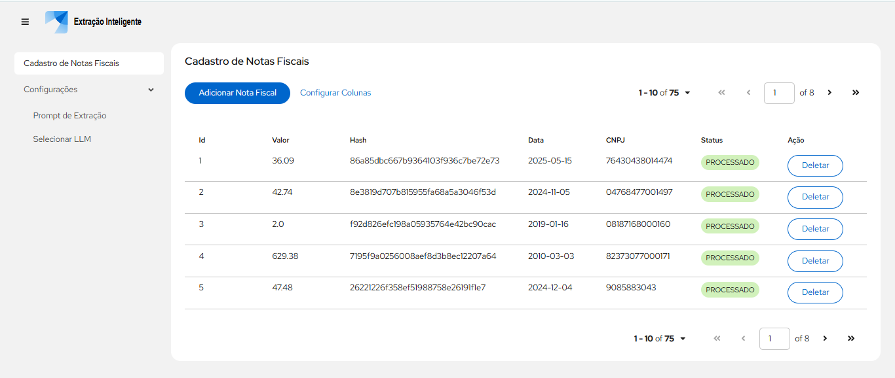
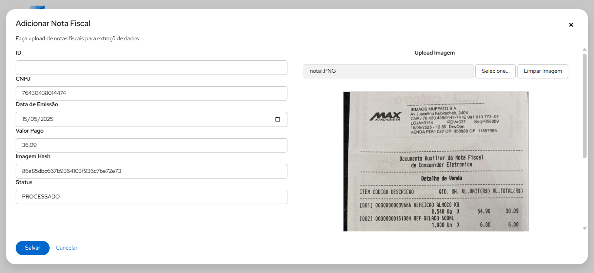
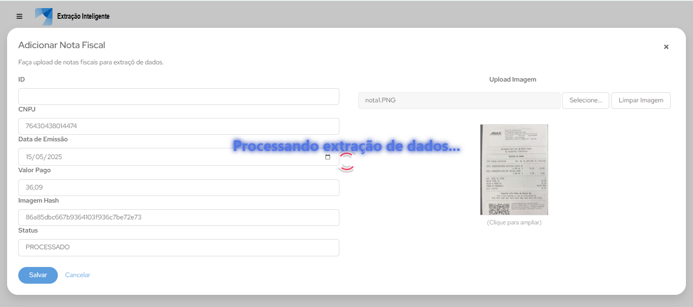

# poc-fastapi-llm-ocr-frontend-react

Frontend utilizado na POC Fastapi com Gemini. Criado para o segundo trabalho do curso da I1A2 em Junho de 2025.

<https://github.com/lyndontavares/poc-fastapi-llm-ocr>

## Run

```bash
npm run start:dev
```

<div align="center">

## Lista de Notas Fiscais



## Adicionar Nota



## Extração de dados



</div>
